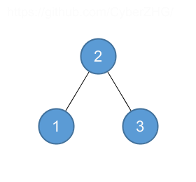
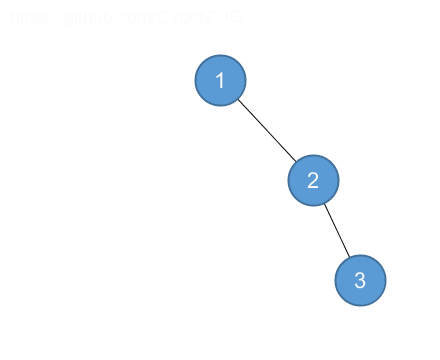
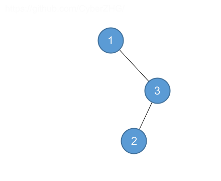
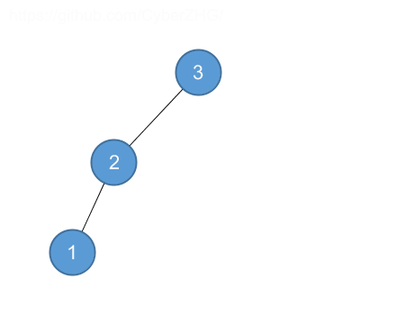
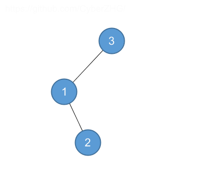

## 12.4 Randomly built binary search trees

### 12.4-1

> Prove equation (12.3).

> $\displaystyle \sum\_{i=0}^{n-1} \binom{i+3}{3} = \binom{n+3}{4}$.

$$
\begin{array}{rll}
\displaystyle \sum\_{i=0}^{n-1} \binom{i+3}{3}
&=& \displaystyle \sum\_{i=0}^{n-1} \frac{(i+3)(i+2)(i+1)}{6} \\\\
&=& \displaystyle \frac{1}{6} \sum\_{i=0}^{n-1} i^3 + 6i^2 + 11i + 6 \\\\
&=& \displaystyle \frac{1}{6} \left ( \frac{(n-1)^2 n^2}{4} + \frac{6(n-1)n(2n-1)}{6} + \frac{11n(n-1)}{2} + 6n \right ) \\\\
&=& \displaystyle \frac{n(n+1)(n+2)(n+3)}{24} \\\\
&=& \displaystyle \binom{n+3}{4}
\end{array}
$$

### 12.4-2

> Describe a binary search tree on n nodes such that the average depth of a node in the tree is $\Theta(\lg n)$ but the height of the tree is $\omega(\lg n)$. Give an asymptotic upper bound on the height of an $n$-node binary search tree in which the average depth of a node is $\Theta(\lg n)$.

$\Theta(\sqrt{n \lg n})$

### 12.4-3

> Show that the notion of a randomly chosen binary search tree on $n$ keys, where each binary search tree of $n$ keys is equally likely to be chosen, is different from the notion of a randomly built binary search tree given in this section.

For $n=3$, there are 5 binary search trees. However, if we build the trees will a random permutation, the first tree will built twice.

### 12.4-4

> Show that the function $f(x) = 2^x$ is convex.

$$
\begin{array}{rll}
\displaystyle f(x) + f(y) - 2f \left ( \frac{x + y}{2} \right )
&=& \displaystyle 2^x + 2^y - 2 \cdot 2^{(x + y)/2} \\\\
&=& \displaystyle (2^{x/2})^2 + (2^{y/2})^2 - 2 \cdot 2^{x/2} \cdot 2^{y/2} \\\\
&=& \displaystyle (2^{x/2} - 2^{y/2})^2 \ge 0
\end{array}
$$

Therefore $f(x) = 2^x$ is convex.

### 12.4-5 $\star$

> Consider RANDOMIZED-QUICKSORT operating on a sequence of $n$ distinct input numbers. Prove that for any constant $k > 0$, all but $O(1/n^k)$ of the $n!$ input permutations yield an $O(n\lg n)$ running time.

$\dots$
