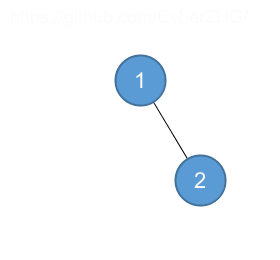
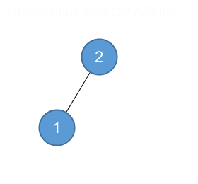

## 13.2 Rotations

### 13.2-1

> Write pseudocode for RIGHT-ROTATE.

```
RIGHT-ROTATE(T, y)
 1  x = y.left
 2  y.left = x.right
 3  if x.right != T.nil
 4      x.right.p = y
 5  x.p = y.p
 6  if y.p == T.nil
 7      T.root = x
 8  elseif y == y.p.right
 9      y.p.right = x
10  else y.p.left = x
11  x.right = y
12  y.p = x
```

### 13.2-2

> Argue that in every $n$-node binary search tree, there are exactly $n - 1$ possible rotations.

Every node can rotate with its parent, only the root does not have a parent, therefore there are $n - 1$ possible rotations.

### 13.2-3

> Let $a$, $b$, and $c$ be arbitrary nodes in subtrees $\alpha$, $\beta$, and $\gamma$, respectively, in the left tree of Figure 13.2. How do the depths of $a$, $b$, and $c$ change when a left rotation is performed on node $x$ in the figure?

$a$: increase by 1.

$b$: unchanged.

$c$: decrease by 1.

### 13.2-4

> Show that any arbitrary $n$-node binary search tree can be transformed into any other arbitrary $n$-node binary search tree using $O(n)$ rotations.

For each left leaf, we perform right rotation until there is no left leaf. We need at most $n-1$ right rotations to transform the tree into a right-going chain. 

Since we can transform every tree into a right-going chain, and the operation is invertible, therefore we can transform one tree into the right-going chain and use the inverse operation to construct the other tree.

### 13.2-5 $\star$

> We say that a binary search tree $T\_1$ can be right-converted to binary search tree $T\_2$ if it is possible to obtain $T\_2$ from $T\_1$ via a series of calls to RIGHT-ROTATE. Give an example of two trees $T\_1$ and $T\_2$ such that $T\_1$ cannot be right-converted to $T\_2$. Then, show that if a tree $T\_1$ can be right-converted to $T\_2$, it can be right-converted using $O(n^2)$ calls to RIGHT-ROTATE.

 

We can use $O(n)$ calls to rotate the node which is the root in $T\_2$ to $T\_1$'s root, then use the same operation in the two subtrees. There are $n$ nodes, therefore the upper bound is $O(n^2)$.
