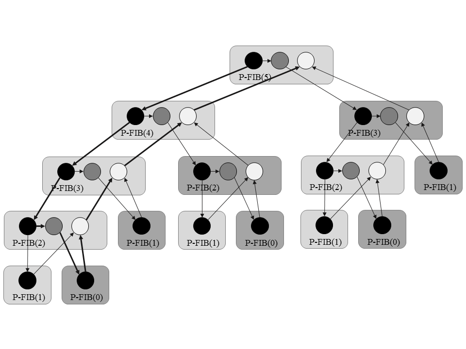

## 27.1 The basics of dynamic multithreading

### 27.1-1

> Suppose that we spawn P-FIB$(n - 2)$ in line 4 of P-FIB, rather than calling it as is done in the code. What is the impact on the asymptotic work, span, and parallelism?

No change.

### 27.1-2

> Draw the computation dag that results from executing P-FIB(5). Assuming that each strand in the computation takes unit time, what are the work, span, and parallelism of the computation? Show how to schedule the dag on 3 processors using greedy scheduling by labeling each strand with the time step in which it is executed.



* Work: $T\_1 = 29$.
* Span: $T\_\infty = 9$.
* Parallelism: $T\_1 / T\_\infty \approx 3.2$.

### 27.1-3

> Prove that a greedy scheduler achieves the following time bound, which is slightly stronger than the bound proven in Theorem 27.1:

> $\displaystyle T\_P \le \frac{T\_1 - T\_\infty}{P} + T\_\infty$.

$T\_1 - T\_\infty$ is the number of  strands that are not belong to the longest path.

### 27.1-4

> Construct a computation dag for which one execution of a greedy scheduler can take nearly twice the time of another execution of a greedy scheduler on the same number of processors. Describe how the two executions would proceed.

The critical path is twice the length of the other path.

### 27.1-5

> Professor Karan measures her deterministic multithreaded algorithm on $4$, $10$, and $64$ processors of an ideal parallel computer using a greedy scheduler. She claims that the three runs yielded $T\_4 = 80$ seconds, $T\_{10} = 42$ seconds, and $T\_{64} = 10$ seconds. Argue that the professor is either lying or incompetent. (Hint: Use the work law (27.2), the span law (27.3), and inequality (27.5) from Exercise 27.1-3.)

Based on span law:

$T\_\infty \le T\_P = \min\\{ 80, 42, 10 \\} = 10$

Based on inequality (27.5):

$\left \\{ 
\begin{array}{rll}
T\_1 + 3T\_\infty &\ge& 320 \\\\
T\_1 + 9T\_\infty &\ge& 420
\end{array}
\right .$

$6 T\_\infty \ge 100$, $T\_\infty \ge 16$, which contradicts the span law.

### 27.1-6

> Give a multithreaded algorithm to multiply an $n \times n$ matrix by an $n$-vector that achieves $\Theta(n^2 / \lg n)$ parallelism while maintaining $\Theta(n^2)$ work.

```
VEC-TIMES-VEC(a, b, l, r)
1  if l == r
2      return a[l] * b[r]
2  m = floor((l + r) / 2)
3  spawn sum_l = VEC-TIMES-VEC(a, b, l, m)
4  spawn sum_r = VEC-TIMES-VEC(a, b, m + 1, r)
5  sync
6  return sum_l + sum_r
```

The multiply of two vectors is thus $\Theta(\lg n)$, there are $n$ vectors to multiply simultaneously, and the outer parallel for is optimized to $\Theta(\lg n)$, therefore $T\_\infty = \Theta(\lg n) + \Theta(\lg n) = \Theta(\lg n)$, since $T\_1 = \Theta(n^2)$, then the parallelism $T\_1 / T\_\infty = \Theta(n^2 / \lg n)$.

### 27.1-7

> Consider the following multithreaded pseudocode for transposing an $n \times n$ matrix $A$ in place:
> 
> ```
P-TRANSPOSE(A)
1  n = A.rows
2  parallel for j = 2 to n
3      parallel for i = 1 to j - 1
4          exchange a_ij with a_ji
```
>
> Analyze the work, span, and parallelism of this algorithm.

* Work: $T\_1 = \Theta(n^2)$.
* Span: $T\_\infty = \Theta(\lg n) + \Theta(\lg n) + \Theta(1) = \Theta(\lg n)$.
* Parallelism: $T\_1 / T\_\infty = \Theta(n^2 / \lg n)$.

### 27.1-8

> Suppose that we replace the__*parallel for*__ loop in line 3 of P-TRANSPOSE (see Exercise 27.1-7) with an ordinary __*for*__ loop. Analyze the work, span, and parallelism of the resulting algorithm.

* Work: $T\_1 = \Theta(n^2)$.
* Span: $T\_\infty = \Theta(\lg n) + \Theta(n) = \Theta(n)$.
* Parallelism: $T\_1 / T\_\infty = \Theta(n)$.

### 27.1-9

> For how many processors do the two versions of the chess programs run equally fast, assuming that $T\_P = T\_1 / P + T\_\infty$?

$$
\begin{array}{rll}
T\_1 / P + T\_\infty &=& T\_1' / P + T\_\infty' \\\\
2048 + P &=& 1024 + 8P \\\\
P &=& 1024 / 7 \\\\
&\approx & 146
\end{array}
$$
